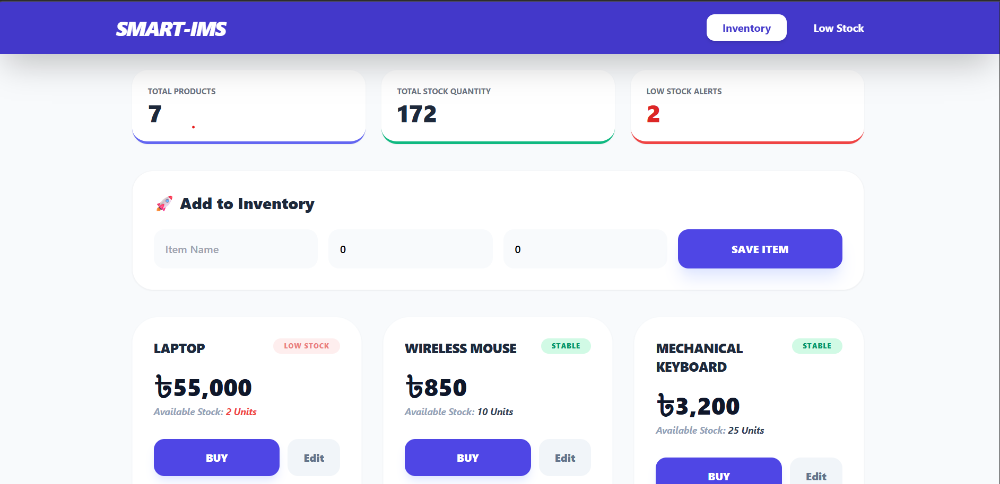

## Here is the Image


# 📦 Smart Inventory Management System (IMS)

A professional, full-stack Inventory Management System designed to streamline stock tracking, sales processing, and restocking alerts. This application features a robust **Spring Boot** backend and a high-performance, responsive **React** frontend.

---

## 🚀 Key Features

* **Live Dashboard Summary:** Instantly view Total Product count, Total Physical Stock, and Low Stock Alerts at a glance.
* **Inventory CRUD Operations:** Seamlessly Create, Read, Update, and Delete inventory items.
* **Smart Sales Management:** * **Buy/Sale Modal:** Process sales through an interactive popup that automatically updates database quantities.
    * **Edit Functionality:** Modify product names, prices, and stock levels with a smooth UI transition.
* **Automated Stock Alerts:** Intelligent flagging of items with stock levels below 5 units.
* **Fully Responsive:** Optimized with Tailwind CSS for high-quality display on Mobile, Tablet, and Desktop.

---

## 🛠️ Tech Stack

### Backend (Core Logic)
* **Java 17**
* **Spring Boot 3.4.1** (Spring Web, Spring Data MongoDB)
* **Database:** MongoDB Atlas (Cloud-based NoSQL)

### Frontend (User Interface)
* **React.js**
* **Styling:** Tailwind CSS (via CDN)
* **Icons:** Lucide-React
* **API Client:** Axios (for seamless Backend communication)

---

## 🏗️ Architecture & OOP Principles

This project is built following strict **Object-Oriented Programming (OOP)** standards:
* **Encapsulation:** Model classes protect data integrity using private fields and public Getters/Setters.
* **Inheritance:** Custom repositories extend `MongoRepository` to inherit advanced database functions.
* **Abstraction:** A 3-tier architecture (Controller -> Service -> Repository) hides internal logic complexity.
* **Dependency Injection:** Spring’s `@Autowired` manages component lifecycles and decouples business logic.


---

## ⚙️ Setup & Installation

### 1. Prerequisites
* JDK 17 or higher
* Node.js (LTS version)
* MongoDB Atlas Account

### 2. Backend Setup
1.  Navigate to the backend directory.
2.  Update `src/main/resources/application.properties` with your MongoDB connection string.
3.  Run the application:
    ```bash
    ./mvnw spring-boot:run
    ```

### 3. Frontend Setup
1.  Navigate to the `ims-frontend` directory.
2.  Install dependencies:
    ```bash
    npm install axios lucide-react
    ```
3.  Start the development server:
    ```bash
    npm start
    ```

---

## 📡 API Endpoints

| Method | Endpoint | Description |
| :--- | :--- | :--- |
| **GET** | `/api/products` | Retrieve all inventory items |
| **POST** | `/api/products` | Create a new product entry |
| **PUT** | `/api/products/{id}` | Update existing product details |
| **PUT** | `/api/products/{id}/sell` | Decrease stock based on sale quantity |
| **GET** | `/api/products/low-stock` | Retrieve items with stock < 5 |


---

## 🤝 Contribution
Feel free to fork this project and submit pull requests. For major changes, please open an issue first to discuss what you would like to change.

---